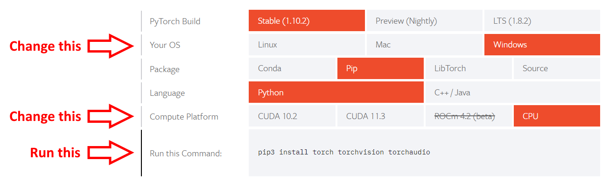

# Bimana

[](https://www.python.org/downloads/)
[](https://github.com/AlphonsG/BIMANA/actions/workflows/python-package.yaml)
[](https://coveralls.io/github/AlphonsG/BIMANA?branch=dev)
[](https://www.codefactor.io/repository/github/alphonsg/bimana/overview/dev)
[](https://github.com/AlphonsG/BIMANA/blob/main/LICENSE)


Package for performing automated bio-image analysis tasks.

# Table of contents
1. <a href="#installation">Installation</a>
2. <a href="#usage">Usage</a>
3. <a href="#license">License</a>
4. <a href="#community-guidelines">Community Guidelines</a>
5. <a href="#acknowledgements">Acknowledgements</a>
## Installation <a id="installation"></a>

Bimana can be installed on Linux, Windows (with 64 bit Python) & macOS and
supports Python 3.10 and above. It is recommended to install and run Bimana
within a [virtual environment](https://docs.python.org/3/tutorial/venv.html).

1. Download and install [Python](https://www.python.org/downloads/) (Bimana was
   tested using [Python version
   3.10.6](https://www.python.org/downloads/release/python-3106/)),
   [Git](https://git-scm.com/) and [Git LFS](https://git-lfs.github.com/).
   Linux and macOS users must also install [libvips](https://www.libvips.org/install.html).

2. Launch the terminal (*Linux* and *macOS* users) or command prompt (*Windows* users). The proceeding commands will be entered into the opened window<sup>1</sup>.

3. Create and activate a virtual environment called 'bimana-env' in your desired directory:

   ```pip install --upgrade pip```

   ```python -m venv bimana-env```

   ```. bimana-env/bin/activate``` (*Linux* and *macOS* users) or ```bimana-env\Scripts\activate.bat``` (*Windows* users)

4. Install PyTorch by specifying your system configuration using the official [PyTorch get started tool](https://pytorch.org/get-started/locally/) and running the generated command:
   <p style="text-align:center;">
    
    </p>
   For example, according to the image above, Windows users without a GPU (i.e. CPU only) will run:

   ```pip3 install torch torchvision torchaudio```


5. Clone this repository into your desired directory:

   ```
   git lfs install
   git clone https://github.com/AlphonsG/BIMANA.git
   ```

6. Navigate into the cloned directory:

    ```cd BIMANA```

7. Install Bimana:

   ```
   git submodule update --init --recursive
   pip install -e .
   ```

Notes:
  - <sup>1</sup>Confirm that the correct python version for Bimana has been installed using the `python -V` command in the terminal. If this command does not report the correct python version, try using the `python3 -v` command instead. If the second command produces the expected result, replace all `python` and `pip` commands in this guide with `python3` and `pip3`, respectively.

  - The virtual environment can be deactivated using:

      ```deactivate```

## Usage <a id="usage"></a>

Enter `bimana -h` or `bimana --help` within the `bimana-env` environment after installation for details on how to use Bimana.

Example commands that can be used to test Bimana using input data provided in
each folder [here](misc/examples) are given below. After
processing is finished for a given folder containing input images, multiple subfolders
containing generated outputs (e.g. images,  CSV files, etc) are created. Examples of these are also provided.

Example commands (first run `cd misc` from the cloned repository folder):

- Histological Section Analysis
   ```
   bimana histological-section-analysis --staining-amount-in-tissue-area  --cilia-amount-above-tissue-area
   ```

- Tight junction analysis
   ```
   bimana tight-junction-analysis misc/examples/tight_junctions  --analyse-tight-junctions --analyse-cells
   ```
- Live cell imaging metrics analysis
   ```
   bimana live-cell-imaging metrics-file-processing misc/examples/live_cell_imaging
   ```

## License <a id="license"></a>

[MIT License](LICENSE)


## Community guidelines <a id="community-guidelines"></a>

 Guidelines for third-parties wishing to:

- Contribute to the software
- Report issues or problems with the software
- Seek support

can be found [here](CONTRIBUTING.md).

## Acknowledgements <a id="acknowledgements"></a>

- https://github.com/xavysp/DexiNed
- https://github.com/DevonsMo/IJOQ
